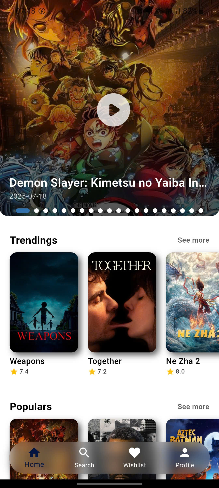
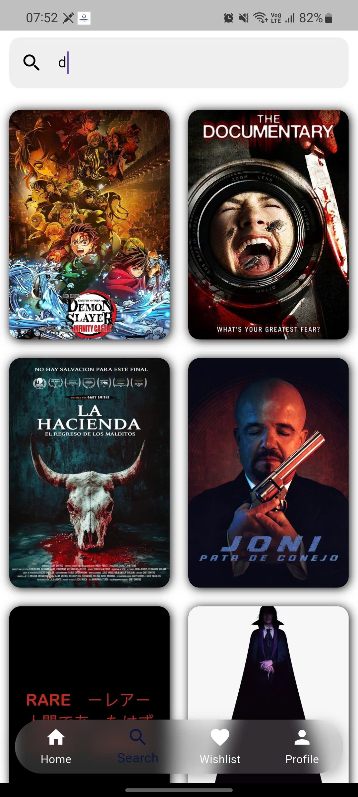
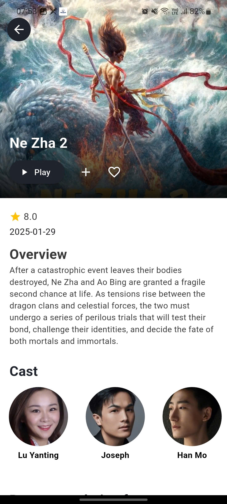

# CineNight - Movie App
Ứng dụng xem phim mobile được phát triển bằng Flutter
Cine giúp giúp bạn dễ dàng khám phá các bộ phim thịnh hành, tìm kiếm các bộ phim yêu thích và lưu trữ để xem lại

## Giới Thiệu Ứng Dụng
CineNight là ứng dụng mobile xem phim với giao diện hiện đại. Người dùng có thể xem danh sách phim mới, trending,
top rated, phim sắp chiếu và lưu danh sách yêu thích.

## Nhóm Phát Triển
- **Vũ Hữu Lưu**

## Tính Năng
- **Khám phá phim:** Xem danh sách phim trending, popular, top rated
- **Tìm kiếm phim:** Tìm kiếm theo tên phim
- **Danh sách yêu thích:** Lưu lại phim bạn quan tâm, yêu thích
- **Đa ngôn ngữ:** Hỗ trợ tiếng Anh và tiếng Việt
- **UI hiện đại:** Thiết kế đẹp mắt, tối ưu trải nghiệm

## Demo Giao Diện

  
  
  

## Công Nghệ Sử Dụng
- **Flutter (Dart)**
- **Provider (State Management)**
- **Http (API Request)**
- **TMdb (The Movie Database)**
- **MySQL Workbench & Aiven**

## Cài Đặt & Chạy Dự Án
- Clone project:
  + https://github.com/VHLuu21/2025_LTTBDD_N02_Nhom_Luu
- Di chuyển vào thư mục:
  + cd cinenight_movie_app
- Cài đặt dependencies:
  + flutter pub get
- Chạy app:
  + flutter run
## Cấu Hình API Key
1. Đăng kí tại The Movie Database (TMdb)
2. Lấy API Key và thêm vào TMdb_api.dart
   - static const String apiKey = "YOUR_API_KEY"

